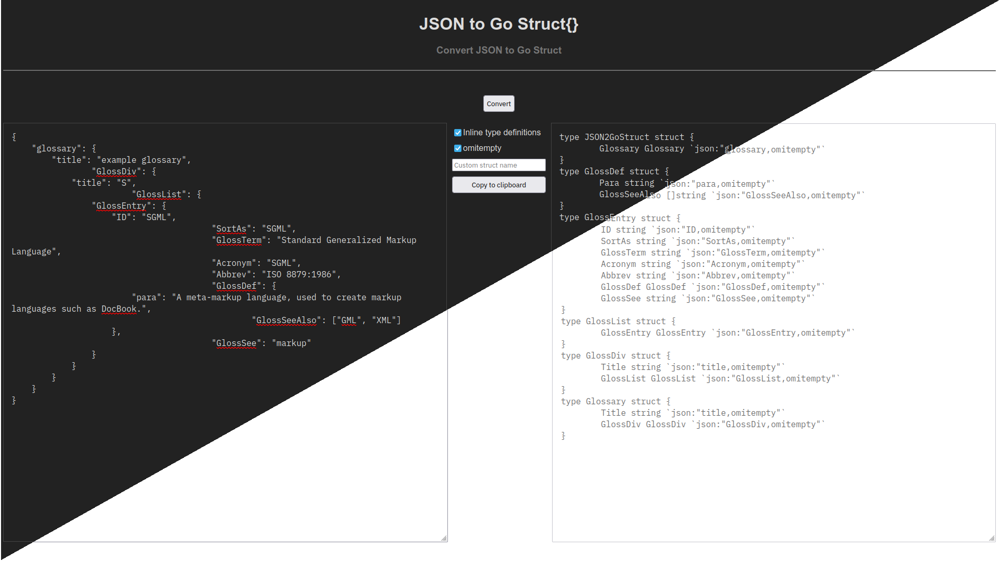

# json2go-struct

Converts JSON into Go struct.

Try it out here: [opp/json2go-struct](https://opp.github.io/json2go-struct/)

### Changes in this fork:

- Removed Google Analytics from the webpage.
- Reworked UI, so no more reliance on jQuery nonsense.
- 5 -> 1 Javscript files loaded. (1.37MB -> 15.11kB)
- Auto dark-mode based on browser/system preference.
- Sane defaults.

### Screenshot:

### To run locally (using Python):

- Clone this repository.
- Run the command `python -m http.server -b localhost` inside the directory where the repository is.

### Credits

All credits for the conversion script goes to the original author [Matt Holt](https://github.com/mholt). Link to original repository is [mholt/json-to-go](https://github.com/mholt/json-to-go).